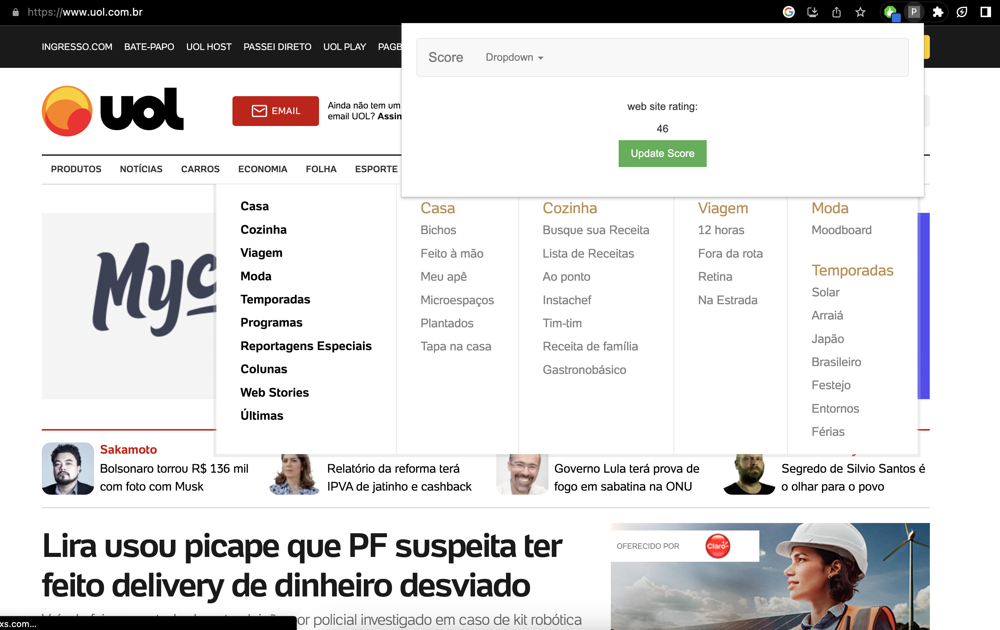
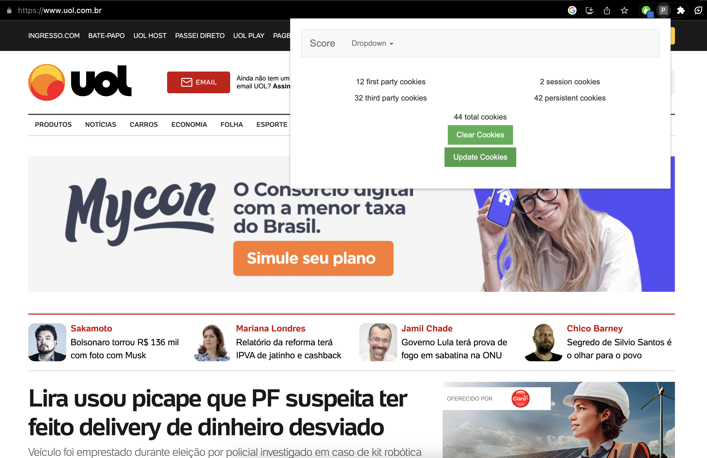
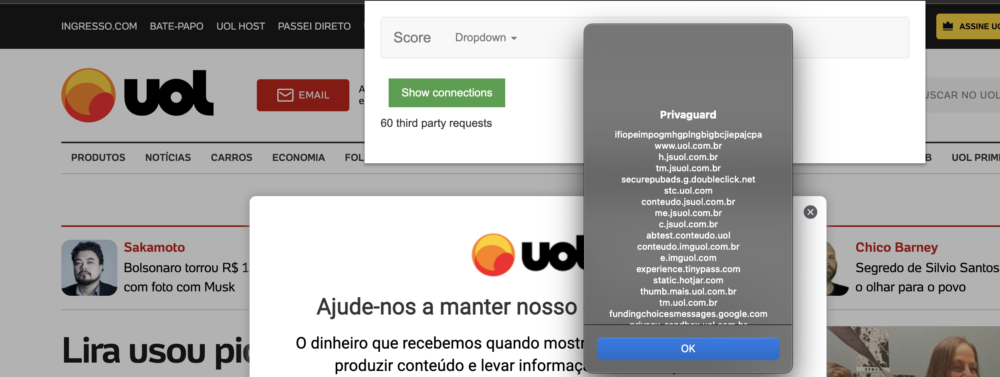
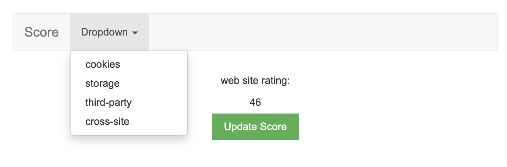
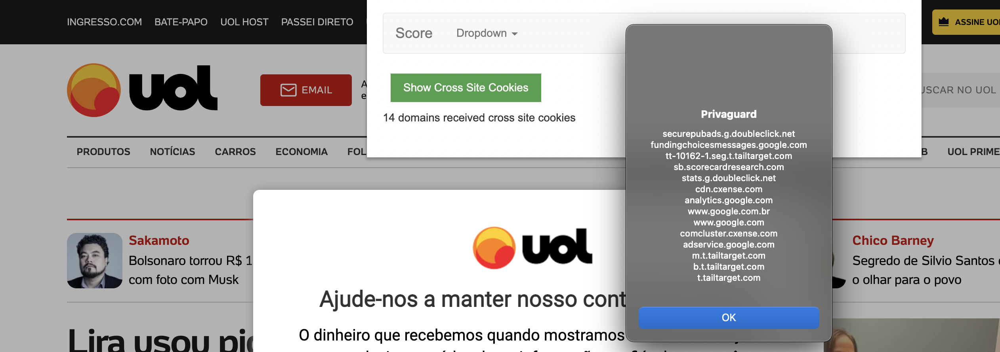

# Privaguard

Privaguard is a Google Chrome extension designed to enhance your online privacy. This tool provides visibility into how websites are accessing and sharing your personal data, empowering you to make informed decisions about your online activities.

**Developed by Paulo Souza Chade.**

## 1. Features of Privaguard

### 1.1. Privacy Score

The privacy score is calculated by using a weighted sum of the total number of cookies, storage items, third-party requests, and cross-site cookies associated with the current domain. This happens within the updateScore function in popup.js.



### 1.2. Detection of trackers and cookies

Detection of trackers and cookies is managed in popup.js. The cookiesHandler.init method gets cookies associated with the current domain. When the 'Display Cookies' form is submitted, cookiesHandler.handleDisplay is called, which handles the display of cookie information.



### 1.3. Ability to view connections across third-party websites

Connections across third-party websites can be viewed by submitting the 'Display Cross Site' form, which sends a display-cross command message to the background. The background script then sends back a response containing the information about domains that received cross-site cookies.



### 1.4. User-friendly dropdown menu for navigation between sections

Navigation between sections is managed by listening to the 'click' events on the elements in the dropdown menu. Each event listener sets the hidden property of the associated section to false and the other sections to true.



### 1.5. Cookie syncing detection

The extension also detects when the website sends cookies to other domains. This is done by analising the header of incoming and outgoing requests.



### 1.6. Real-time updates of data tracking information

Real-time updates of data tracking information are handled by the event listeners set up in background.js. They listen to changes to the tab and web requests, invoking appropriate methods of the ThirdPartyReq class when they occur. The messages and data related to third-party requests are communicated to the popup script using chrome.runtime.onMessage.

## 2. Installation

Follow these steps to get the extension up and running on your Chrome browser:

1. Download all project files or clone this repository to your local machine.

    `git clone https://github.com/pauloschade/TECHACK-PROJETO`

2. Open your Chrome browser and type `chrome://extensions` into the URL bar.

3. Turn on 'Developer mode'. This switch is located in the top-right corner of the page.

4. Click on the 'Load unpacked' button and select the downloaded or cloned project folder.

The Privaguard extension is now ready to use!

## 3. Usage

After the installation, you can start using Privaguard immediately.

1. Navigate to any website and click on the Privaguard icon on the Chrome toolbar.

2. Privaguard will display real-time information about how the current website is accessing and sharing your data.

3. Use the dropdown menu within the extension to navigate between different sections and get detailed insights.

## 4. Development

The project is organized into the following folders:

```bash
Privaguard
│
├── css
│   ├── bootstrap.min.css
│   └── main.css
│
├── js
│   ├── bootstrap.min.js
│   ├── jquery.min.js
│   └── min-js
│       └── popper.min.js
│
├── src
│   ├── cookies
│   │   └── cookies.js
│   ├── logger
│   │   └── logger.js
│   ├── scorer
│   │   └── scorer.js
│   ├── storage
│   │   └── storage.js
│   └── thirdParty
│       └── ThirdPartyReq.js
│
├── README.md
├── background.js
├── manifest.json
├── popup.css
├── popup.html
└── popup.js
```

The src folder contains the source code for the different features of the extension. It's organized in subfolders for each of the features explained below.

`cookies.js`: This file contains a class Cookies that is used to manage cookies for a particular domain. It provides functionality to get all cookies (get), delete all cookies (handleDelete), and display cookie details (handleDisplay), among other operations. The class keeps track of the types of cookies (e.g., first-party, third-party, session, persistent) and the domains synchronized with these cookies.

`logger.js`: This script contains a Logger class that is used for logging messages to the console. The init method is used to set the tab ID for which the messages will be logged. The log method logs a message to the console of the specified tab.

`scorer.js`: This script contains a Scorer class that is presumably used to calculate a privacy score based on various elements and their corresponding weights. Currently, the calculateScore method calculates the score by multiplying the count of each element with its weight, and summing up these products.

`storage.js`: This script includes a Storage class used for managing the local and session storage of a web page. It can get the storage data (get), delete all storage data (handleDelete), and display the count of keys in the local and session storage (handleDisplay).

`ThirdPartyReq.js`: This file contains a class ThirdPartyReq that checks for third-party and cross-site requests made from a webpage. It can check if a network request is third-party (checkReq) and if a request contains cross-site request headers (checkHeaders). It seems to be used for detecting potential tracking activities by third-party domains.

The `background.js` file contains the event listeners and message handlers for the background script. 

The `popup.js` file contains the event listeners and message handlers for the popup script. Finally, the `popup.html` file contains the HTML code for the popup window and the `popup.css` file contains the CSS code for the style of the popup window.

## 5. Contributing

We welcome contributions from the community. If you would like to contribute to the development of Privaguard, please follow these guidelines:

1. Fork the repository.

2. Create a new branch for your feature.

3. Submit your changes via a pull request.
